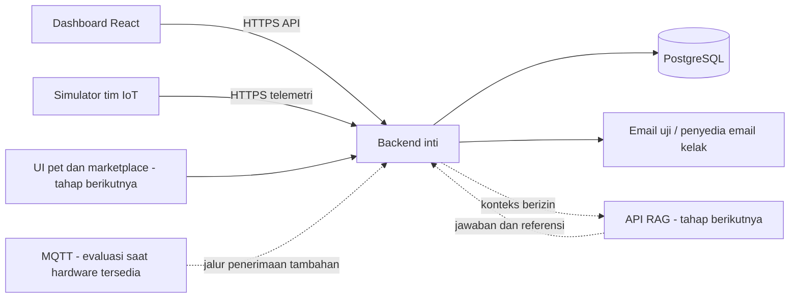

# Persiapan Pilot Dashboard JagoFarm

Tanggal: 9 September 2026  
Status: rangkuman keputusan perencanaan; bukan laporan implementasi selesai.  
Workspace: `Dashboard TA JagoFarm`.

## 1. Tujuan dan cara membaca dokumen

Membangun fondasi agar dashboard UI berkembang bertahap menjadi platform IoT, AI/RAG, virtual pet, dan marketplace tanpa penulisan ulang besar pada frontend.

**Pilot** adalah uji coba terbatas dengan pengguna nyata. Pilot pertama menguji software menggunakan perangkat simulator, bukan membuktikan keandalan hardware fisik.

- **Disepakati:** keputusan dalam diskusi yang menjadi dasar pekerjaan.
- **Usulan persiapan:** rincian awal untuk membantu tim; kontrak teknisnya belum dibekukan.
- **Ditunda/terbuka:** belum menjadi keputusan final dan tidak boleh dianggap sudah tersedia.

Belum ada tenggat tetap. Pekerjaan dilakukan bertahap dengan fondasi integrasi sebagai prioritas. Dokumen ini tidak menggantikan audit lengkap seluruh dummy data, spesifikasi API, ERD, maupun desain produksi yang masih perlu disusun.

## 2. Kondisi awal

Berdasarkan pemeriksaan source pada percakapan ini:

- Frontend menggunakan React, Vite, React Router, Tailwind CSS, dan Chart.js.
- `src/App.jsx` menyusun halaman dan menghubungkannya dengan state serta simulator.
- `src/store/useFarmStore.js` mengelola state lokal; role, sensor, log, dan pengaturan menggunakan `localStorage`.
- `src/services/iotSimulator.js` menghasilkan telemetri di browser.
- `src/services/ragService.js` dapat memanggil endpoint konfigurasi pengguna dan menggunakan respons lokal sebagai fallback. Ini bukan bukti tersedianya layanan RAG nyata.
- Route yang diperiksa: `/`, `/tanah`, `/cuaca`, `/analitik`, `/riwayat`, `/sensor`, `/ensiklopedia`, `/pengaturan`, `/profil`, dan `/ai`.
- Backend produksi, autentikasi nyata, pipeline IoT fisik, dan layanan RAG belum tersedia menurut konteks proyek.

Verifikasi sebelumnya: build berhasil, lint selesai dengan dua warning, dan sepuluh route mengembalikan HTTP 200 beserta app shell. Pengujian render/interaksi browser belum dilakukan karena browser tidak terhubung. HTTP 200 bukan bukti keberhasilan UI end-to-end.

Warning yang tercatat: parameter `userRole` tidak digunakan, `Math.random()` saat render modal penambahan sensor, dan bundle JavaScript di atas 500 kB. Temuan ini bukan audit lengkap.

## 3. Batas pilot dan urutan kerja

### Disepakati

- Target uji: maksimal 10 akun dan total 20 perangkat simulasi.
- Satu kiriman telemetri per perangkat setiap 30 detik.
- Kepemilikan perangkat per akun pribadi; berbagi akses organisasi belum termasuk.
- Hardware belum tersedia. Pilot boleh selesai dengan simulator melalui backend.
- Pilot membaca telemetri dan menghasilkan alert; tidak mengendalikan pompa/aktuator.
- Pet, marketplace, dan RAG menyusul setelah fondasi pilot inti.
- Tidak ada uang atau pengiriman barang nyata pada marketplace tahap awal.

### Urutan awal

1. Audit sumber data, sepakati kontrak, dan siapkan mock API.
2. Sprint pertama: akun uji → pemasangan perangkat simulator → penerimaan telemetri → daftar/detail perangkat di dashboard.
3. Sprint kedua: alert deterministik, status offline, dan email di kotak surat uji.
4. Integrasi pengiriman email nyata dan pengujian pilot lintas akun.
5. Integrasi perangkat fisik, pet, RAG, dan marketplace mengikuti kesiapan tim.

Email nyata tetap kebutuhan pilot. Kotak surat uji hanya sarana pengembangan, bukan bukti bahwa email telah sampai ke pengguna. Simulasi end-to-end juga tidak menggantikan validasi hardware pada tahap berikutnya.

## 4. Tim, stack, dan batas integrasi

| Penanggung jawab | Tanggung jawab |
| --- | --- |
| Tim dashboard/backend inti | Autentikasi, database operasional, kepemilikan perangkat, API bersama, validasi/persistensi telemetri, alert, notifikasi, dan status deterministik pet |
| Tim IoT | Modul IoT, perangkat/firmware kelak, simulator dan format pesan bersama tim backend; detail kepemilikan infrastruktur MQTT dibahas saat diperlukan |
| Tim RAG/LLM | API RAG sendiri, dokumen, retrieval, pemanggilan LLM, jawaban dan referensi |
| Tim virtual pet dan store | Karakter, animasi, koleksi kosmetik, katalog, pesanan, serta marketplace |

Backend inti menjadi pusat integrasi; browser React bukan perantara antarlayanan.

**Stack disepakati:** Node.js + Fastify + TypeScript dan PostgreSQL. Frontend React yang ada dipertahankan. Backend awal berupa satu aplikasi modular; tidak perlu memecah semua domain menjadi microservice.

Dashboard dan backend inti berada dalam satu repository. Modul tim lain dapat berada di repository masing-masing dengan kontrak bersama. Versi Node.js, library autentikasi, alat migrasi/akses database, dan struktur folder final belum ditetapkan.

Diagram menunjukkan batas integrasi logis, bukan keputusan bahwa seluruh kode marketplace harus dijalankan dalam proses backend yang sama. Penempatan layanan store masih perlu dirinci bersama timnya.

## 5. Akun, admin, dan kepemilikan perangkat

- Registrasi pilot melalui undangan admin, verifikasi email, dan pembuatan password.
- Satu identitas akun digunakan dashboard, pet, dan marketplace.
- Satu peran admin pilot mengundang pengguna, mengalokasikan perangkat, dan menangani perpindahan perangkat.
- Penguji menggunakan akun admin, pengguna A, dan pengguna B yang terpisah.
- Backend memeriksa kepemilikan pada setiap akses perangkat dan data; role di frontend bukan pengamanan.
- Akses tim proyek ke dataset evaluasi belum difinalkan. Peran admin tidak otomatis berarti izin membaca semua telemetri.

### Pemasangan dan pelepasan

1. Hanya perangkat yang disediakan tim proyek dapat dipasangkan.
2. Pengguna memasukkan kode aktivasi sekali pakai atau memindai QR.
3. Backend memvalidasi unit, kode, akun yang berhak, dan status kepemilikan.
4. Untuk unit tanpa pembelian, admin mengalokasikan perangkat simulator ke akun pilot.
5. Aktivasi awal perangkat pembelian hanya boleh dilakukan akun pembeli.
6. Menambah/melepas berarti perangkat utuh dari akun; penggantian sensor di dalam unit tidak termasuk pilot.
7. Perpindahan: pemilik lama melepas perangkat, lalu admin menerbitkan kode aktivasi baru.
8. Riwayat yang masih disimpan tetap terkait pemilik lama; pemilik baru hanya melihat data sejak periode kepemilikannya.

Kode aktivasi pengguna harus dibedakan dari kredensial pengiriman telemetri perangkat. Detail penerbitan, penyimpanan aman, rotasi, serta pembatasan percobaan akan masuk kontrak provisioning.

Aturan retensi/penghapusan akun belum final. Pernyataan pemisahan riwayat di atas adalah aturan akses, bukan janji penyimpanan permanen.

## 6. Kontrak awal IoT dan pengalaman dashboard

### Model simulator disepakati

| Model | Sensor | Satuan |
| --- | --- | --- |
| Pemantau air | Suhu air, pH, EC | °C, pH, mS/cm |
| Pemantau lingkungan | Suhu udara, kelembapan | °C, %RH |

Model ini untuk pengujian, bukan keputusan pembelian hardware. DO tidak ditambahkan hanya untuk mengejar contoh animasi kekurangan oksigen. Sensor dan satuan mengikuti model perangkat; dashboard tidak mewajibkan semua perangkat memiliki sensor yang sama.

- Simulator mengirim melalui HTTPS dengan kredensial unik per perangkat.
- MQTT dievaluasi saat kebutuhan hardware jelas; perangkat fisik tidak otomatis wajib memakai MQTT.
- Jalur HTTPS dan MQTT kelak menggunakan kontrak telemetri serta proses validasi yang sama.
- Saat koneksi putus, simulator menyimpan sementara lalu mengirim ulang.
- Backend mempertahankan waktu pengukuran asli dan mencegah duplikasi.
- Kiriman terlambat masuk riwayat, tidak dianggap kondisi baru untuk memicu email.

**Usulan isi kontrak yang harus dibekukan sebelum implementasi:** identitas unit, versi pesan/model, ID kiriman untuk deduplikasi, waktu pengukuran, waktu penerimaan server, dan daftar pembacaan berdasarkan kode sensor. Format JSON, toleransi jam perangkat, batas payload, kapasitas buffer, retry, dan definisi data terlambat belum final.

### Dashboard

- Akun tanpa perangkat menampilkan kondisi kosong dan tombol **Tambah Perangkat**.
- Halaman ringkasan menampilkan seluruh perangkat serta alert aktif.
- Detail satu perangkat menampilkan sensor dan grafik sesuai modelnya; data antarperangkat tidak dicampur.
- Sprint pertama menggunakan satu halaman detail dinamis, bukan langsung menghubungkan semua halaman lama.
- Polling setiap 30 detik selama halaman aktif, pembaruan saat kembali ke halaman, dan tombol **Segarkan**.
- Nilai terakhir tetap terlihat dengan waktu pengukurannya.
- Data ditandai terlambat setelah 90 detik; perangkat offline setelah 3 menit tanpa data.
- Data hilang tidak dianggap normal. Timestamp harus jelas agar nilai lama tidak terlihat aktual.

### Penjelasan sumber data untuk penguji

| Label | Makna |
| --- | --- |
| Data contoh / Demo | Fixture atau respons lokal untuk menunjukkan UI |
| Simulator melalui backend | Data perangkat virtual yang melalui autentikasi, API, dan penyimpanan backend |
| Perangkat fisik | Telemetri hardware nyata pada tahap berikutnya |

Dummy boleh tetap tampil dengan label jelas. Data contoh tidak memicu email dan tidak masuk ekspor telemetri akun. Asisten lokal diberi label **Respons demo otomatis — bukan hasil RAG**. Kegagalan layanan nyata tidak boleh diam-diam terlihat seperti respons RAG berhasil.

## 7. Alert dan notifikasi

### Aturan disepakati

| Perilaku | Aturan awal |
| --- | --- |
| Ambang | Waspada dan kritis per sensor/perangkat; default model dapat disesuaikan pemilik |
| Waspada | Pelanggaran berlangsung 2 menit |
| Kritis | Dua pembacaan terbaru berturut-turut melewati ambang kritis, sekitar 30 detik pada interval normal |
| Pemulihan | Pembacaan normal selama 2 menit |
| Offline | Tidak ada data selama 3 menit |
| Offline saat alert sensor aktif | Alert sensor tidak otomatis selesai |
| Email awal | Saat alert aktif |
| Pengingat | Setiap 30 menit selama alert belum pulih |
| Eskalasi | Waspada menjadi kritis mengirim email langsung, lalu jadwal pengingat dimulai kembali |
| Email pemulihan | Sekali ketika kondisi pulih |
| Sudah dibaca | Tidak menghentikan pengingat |
| Penggabungan | Alert pengguna yang sama digabung agar tidak memenuhi inbox |

Backend menjalankan aturan tanpa bergantung pada halaman terbuka atau LLM. Validasi ambang harus menjaga urutan rentang normal, waspada, dan kritis.

**Masih perlu spesifikasi:** perilaku kritis turun ke waspada, penghitungan durasi ketika sampel hilang, pengaruh perubahan ambang pada alert aktif, penggabungan email versus eskalasi segera, dan pencegahan email ganda setelah restart. Jangan mengasumsikan detail ini telah disepakati.

Email wajib untuk pilot; WhatsApp tahap berikutnya. SMTP/penyedia email dan domain pengirim belum tersedia atau terkonfirmasi. Pengembangan menggunakan kotak surat uji. Pengiriman inbox nyata harus diuji sebelum dinyatakan selesai.

## 8. Database dan hosting: batas yang diketahui

Hosting: panel Kroombox dari startup internal kampus.

- Panel memperlihatkan React, Node.js, dan pilihan PostgreSQL 17.
- Konfigurasi mencakup folder `package.json`, env, port, subdomain/prefix, instalasi dependency, build, serta migrasi.
- Menurut pengguna, backend tetap berjalan saat tidak ada pengunjung.
- Alokasi database hanya **2 GB**.
- Akses prefix `/api` pada origin dashboard merupakan usulan, belum diverifikasi routing-nya.
- Dukungan versi runtime, worker, jadwal background, backup, batas koneksi, ekstensi database, dan konektivitas layanan lain perlu dikonfirmasi.

**Pembahasan detail database ditunda atas permintaan pengguna.**

Sebelum ditunda, opsi yang dibahas adalah target data asli tujuh hari, ringkasan lebih lama, dan arsip ke komputer tim sebelum penghapusan. Ini **belum boleh diterapkan sebagai kebijakan final**, terutama karena kapasitas nyata, izin akses arsip, backup, dan penghapusan belum selesai dibahas.

Pilihan sementara pilot tidak menggunakan object storage. Unduhan langsung CSV satu perangkat maksimal tujuh hari adalah **usulan batas**, bukan keputusan final. Alur ekspor besar di belakang layar dengan tautan siap-unduh dari disk/object storage bukan kemampuan yang sudah dijanjikan untuk pilot ini.

Pada target penuh terdapat 57.600 kiriman per hari, sekitar 21 juta per tahun. Kiriman tidak selalu sama dengan satu baris database; ukuran bergantung pada jumlah sensor dan skema. Jangan menjanjikan retensi permanen dalam 2 GB. Lakukan pengukuran ukuran data dan indeks sebelum menetapkan retensi. Tidak ada penghapusan otomatis yang diotorisasi oleh dokumen ini.

## 9. Integrasi berikutnya: RAG, pet, marketplace

### RAG

- Tim RAG mempunyai API sendiri.
- Browser mengakses backend inti; backend memanggil RAG dengan autentikasi antarlayanan.
- Backend mengirim konteks secukupnya untuk perangkat pilihan yang diizinkan.
- RAG tidak memiliki akses langsung/tidak terbatas ke database operasional.
- Tahap awal hanya-baca: tidak mengubah ambang, mengendalikan aktuator, melepas perangkat, atau membeli barang.
- Sumber awal berupa dokumen terkurasi tim; upload pengguna belum diperlukan.
- Jawaban menyertakan referensi jika tersedia.
- Detail model, vector storage, ingestion, dan internal pipeline ditunda bersama tim RAG.

### Virtual pet

- Satu pet dasar gratis per akun.
- Pengguna bisa memiliki beberapa pet, tetapi hanya satu aktif sebagai asisten.
- Pet dan aksesori berbayar hanya kosmetik; tidak meningkatkan akurasi AI atau akses alert.
- Semua aksesori kompatibel dengan semua pet.
- Pet/aksesori dimiliki permanen sebagai koleksi, satu item cukup dibeli sekali; tombol menjadi **Dimiliki**.
- Pet mengikuti perangkat yang sedang dibuka. Pada ringkasan tanpa pilihan perangkat, pet netral dan menyampaikan jumlah alert global.
- Status perangkat ditentukan backend; RAG menjelaskan, tim pet memetakan status ke animasi.
- Lima status dasar: netral, normal, waspada, kritis, tidak terhubung.
- Prioritas: offline → kritis → waspada → normal; alert lama tetap belum selesai saat offline.
- Berpikir, berbicara, dan gagal merespons adalah status interaksi AI terpisah, tidak menutupi peringatan perangkat.
- Animasi khusus belum ditentukan; gunakan pemetaan umum dahulu.

### Marketplace

Marketplace dibangun tim virtual pet/store dan menggunakan akun yang sama dengan dashboard.

**Tambah Perangkat** mempunyai dua jalur:

1. Sudah memiliki unit → masukkan kode/pindai QR → pasangkan.
2. Beli di marketplace internal → checkout simulasi → unit dan kode langsung tersedia → pasangkan secara eksplisit.

- Checkout belum memakai uang/pengiriman nyata.
- Pembelian tidak otomatis mengaktifkan perangkat.
- Aktivasi pertama terikat akun pembeli; transfer melalui admin.
- Pembelian pet/aksesori berhasil menambah koleksi akun.
- Produk katalog berbeda dari unit fisik/simulasi beridentitas unik.
- Modul transaksi tetap dipisahkan dari telemetri operasional. Detail API store, idempotensi checkout, dan pencatatan unit lintas modul perlu disepakati bersama tim store.

## 10. Persiapan sprint pertama

### Hasil yang dituju

Penguji dapat masuk dengan akun uji, memasangkan unit yang dialokasikan, menerima data simulator melalui backend, lalu melihat daftar dan detail perangkat. Pengguna lain tidak dapat mengakses unit atau telemetrinya.

### Daftar pekerjaan persiapan

- [ ] Audit dummy data per halaman: sumber, konsumen, entitas masa depan, service/API, dan jenis data.
- [ ] Sepakati pemilik kontrak dan mekanisme perubahan versi bersama tim IoT.
- [ ] Bekukan kontrak model, provisioning, telemetri, timestamp, deduplikasi, dan error API.
- [ ] Pilih library autentikasi/sesi serta mekanisme migrasi database; hindari kriptografi buatan sendiri.
- [ ] Konfirmasi Node.js yang didukung, start command, env port, routing `/api`, dan migrasi panel.
- [ ] Tentukan cara membuat akun uji tanpa mengandalkan email produksi; undangan dapat diperiksa melalui kotak surat uji.
- [ ] Susun struktur repository dashboard + backend tanpa memindahkan file UI secara membabi buta.
- [ ] Definisikan mock API dan implementasi backend di balik kontrak yang sama.
- [ ] Tentukan pengukuran penggunaan database 2 GB dan cara membatasi dataset uji sebelum retensi final.
- [ ] Siapkan panduan penguji serta hasil yang diharapkan.

### Cakupan implementasi sprint pertama setelah kontrak selesai

1. Bootstrap API Fastify/TypeScript dengan konfigurasi tervalidasi, health check, penanganan error, logging tanpa secret, dan migrasi.
2. Akun admin/pengguna uji dan sesi; pemeriksaan kepemilikan backend.
3. Registri dua model perangkat, alokasi unit simulator, dan aktivasi sekali pakai.
4. Ingestion HTTPS, validasi pembacaan, deduplikasi, timestamp, serta penyimpanan data terbaru/riwayat uji.
5. Simulator yang mengirim ke backend dan dapat menjalankan putus/sambung koneksi.
6. Data layer frontend; daftar/detail perangkat dinamis, kondisi kosong/loading/error, sumber data, dan polling.
7. Dokumentasi menjalankan lokal dan pengujian staging.

**Usulan kelompok entitas:** pengguna/sesi, model dan sensor model, unit/kredensial, periode kepemilikan, kode aktivasi, serta pembacaan telemetri. Ini belum ERD final; jangan membuat semua tabel dalam brief besar sekaligus.

**Usulan kelompok API:** identitas/sesi, daftar perangkat, pairing, detail perangkat, pembacaan terbaru/riwayat, ingestion perangkat, dan health check. Nama route, payload, pagination, dan skema error harus dibekukan sebelum implementasi lintas tim.

Frontend tidak boleh menyebar pengecekan mode mock/API di setiap komponen. Pergantian sumber dilakukan di data layer. Source produksi tidak boleh diam-diam diganti dummy ketika API gagal.

### Tidak menjadi syarat sprint pertama

Pembayaran, RAG nyata, animasi pet, MQTT, hardware, WhatsApp, sistem organisasi, ekspor arsip permanen, atau penyelesaian semua halaman demo.

## 11. Test case dan kriteria selesai

### Sprint pertama

| ID | Skenario | Hasil yang diharapkan |
| --- | --- | --- |
| S1-01 | Akun baru tanpa unit | Kondisi kosong; tidak ada telemetri contoh yang dianggap milik akun |
| S1-02 | Pairing kode valid untuk akun A | Unit tampil di akun A |
| S1-03 | Kode salah, sudah dipakai, atau milik akun lain | Ditolak tanpa mengubah kepemilikan |
| S1-04 | B mengakses ID perangkat/riwayat milik A langsung melalui API | Ditolak oleh backend |
| S1-05 | Simulator beridentitas valid mengirim dua model | Sensor dan satuan ditampilkan sesuai model |
| S1-06 | Kredensial salah, sensor/payload tidak valid | Ditolak; tidak mencemari data |
| S1-07 | Kiriman yang sama dikirim ulang | Tidak menjadi pembacaan ganda |
| S1-08 | Putus koneksi lalu kirim buffer | Timestamp asli dipertahankan; data lama tidak menggantikan nilai terbaru |
| S1-09 | Halaman aktif, kembali aktif, dan Segarkan | Pembaruan mengikuti kebijakan polling |
| S1-10 | Backend tidak tersedia | Error terlihat, bukan fallback dummy tersembunyi |
| S1-11 | Restart backend / refresh browser | Kepemilikan dan data tersimpan tetap tersedia |

Sprint selesai ketika alur inti berhasil melalui backend nyata dengan database, test isolasi akses lulus, dokumentasi dapat diikuti anggota tim lain, dan label simulasi jelas. Build/lint saja tidak cukup; pengujian browser harus benar-benar dijalankan saat sarana tersedia.

### Sprint kedua dan tahap berikutnya

- Waspada 2 menit; kritis dua sampel terbaru; pemulihan 2 menit.
- Data terlambat 90 detik dan offline 3 menit; offline tidak menyelesaikan alert sensor.
- Email awal, eskalasi segera, pengingat 30 menit, dan pemulihan; dibaca tidak menghentikan pengingat.
- Restart tidak menghilangkan pekerjaan notifikasi atau menghasilkan pengiriman ganda.
- Kiriman historis tidak memicu kejadian lama sebagai alert baru.
- Transfer unit tidak membocorkan riwayat pemilik lama.
- Pet mengikuti perangkat pilihan; gangguan RAG tidak menghentikan status deterministik.
- Checkout simulasi dan aktivasi terpisah; akun lain tidak dapat memakai kode pembeli.

Panduan penguji harus menjelaskan **Admin Pilot**, dua akun pengguna, perbedaan dummy/simulator/hardware, belum adanya RAG nyata, dan tidak adanya pembayaran nyata.

## 12. Keputusan terbuka sebelum melangkah lebih jauh

| Hal | Status / tindak lanjut |
| --- | --- |
| Retensi, arsip, penghapusan akun, dan akses dataset tim | Ditunda atas permintaan pengguna; tidak boleh diimplementasikan secara asumsi |
| Kapasitas nyata database dan backup | Ukur data/index; konfirmasi ke pengelola hosting |
| Pengiriman email nyata dan DNS | Belum tersedia; gunakan mailbox uji dahulu |
| Library auth, database, runtime dan deployment detail | Putuskan saat persiapan teknis berdasarkan hosting |
| Kontrak API lengkap dan ERD | Belum dibekukan; menjadi keluaran persiapan sprint |
| Batas buffer/retry, waktu perangkat, dan data terlambat | Rinci bersama tim IoT |
| Edge case alert dan penggabungan notifikasi | Rinci sebelum sprint kedua |
| RAG internal, biaya provider, dan referensi dokumen | Dibahas bersama tim RAG pada tahap berikutnya |
| Daftar animasi serta kontrak modul store | Dibahas bersama tim virtual pet/store |
| MQTT dan hardware fisik | Evaluasi ketika perangkat serta koneksinya jelas |

Langkah berikutnya adalah menyelesaikan audit terarah dan kontrak sprint pertama. Tidak perlu membangun seluruh visi platform sekaligus.
