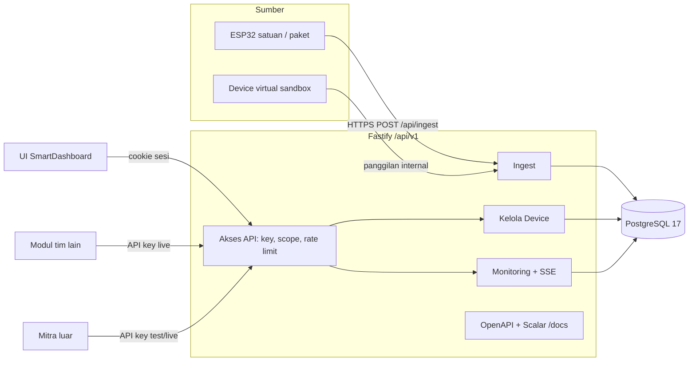
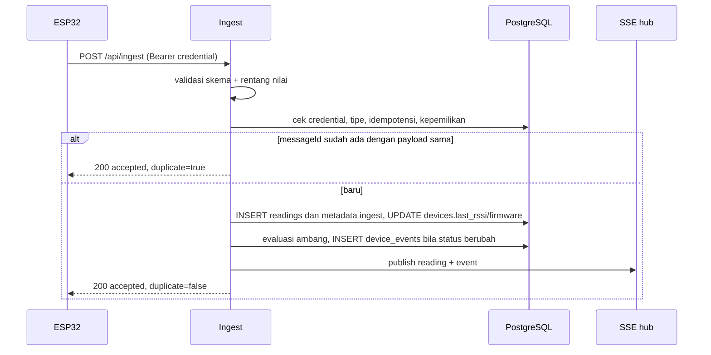

# Technical Design: IoT System JagoFarm

| Atribut | Isi |
| --- | --- |
| Pemilik | Haykal |
| Status | Draft v0.1 |
| Tanggal | 3 Oktober 2026 |
| Dasar | PRD v0.1, kode di `dev/antigravity` commit `3561116` |

## 1. Ringkasan

Backend pilot yang sudah ada (Fastify 5 + PostgreSQL 17) dikembangkan, bukan diganti. Semua fitur baru tinggal di bawah prefix `/api/v1`. Route pilot lama (`/api/*`) tetap jalan sampai `PilotApp.jsx` tidak dipakai lagi. Perubahan terbesarnya ada empat:

1. Model perangkat pindah dari konstanta `models` di `server/domain.ts` ke tabel (`sensor_types`, `device_types`, `device_type_sensors`).
2. Ada jenis kredensial ketiga, yaitu API key, di samping sesi cookie dan credential device.
3. Ingest v2 menerima IoT satuan (1 sensor) dan paket (beberapa sensor).
4. UI SmartDashboard mulai memakai sesi backend dan membaca data IoT dari API.

## 2. Arsitektur



Asumsi deployment: satu instance API. SSE, rate limit (`@fastify/rate-limit` memakai store memori), dan runner device virtual berjalan di proses yang sama. Kalau nanti lebih dari satu instance, ketiganya perlu dipindah ke Redis atau `LISTEN/NOTIFY` PostgreSQL.

## 3. Struktur kode yang diusulkan

`server/app.ts` sekarang satu file berisi 223 baris. Supaya bisa dikerjakan per minggu tanpa konflik, route baru dipisah:

```
server/
  app.ts                  # buildApp: plugin global, error handler, pendaftaran modul
  domain.ts               # hash, secret, connectionStatus (models dihapus setelah migrasi)
  db.ts                   # pool, transaction, migrate (bernomor)
  migrations/
    001_pilot.sql         # isi schema.sql sekarang
    002_iot_platform.sql
  auth/
    session.ts            # sesi cookie (pindahan dari app.ts)
    api-key.ts            # parsing Bearer jf_*, scope, environment
  v1/
    sensor-types.ts
    device-types.ts
    devices.ts            # CRUD, QR, claim, release
    ingest.ts             # v1 + v2
    readings.ts           # latest, riwayat teragregasi, overview per sensor
    events.ts             # log kejadian
    stream.ts             # SSE
    keys.ts               # API key + usage
  sandbox/
    runner.ts             # device virtual + skenario
  simulator.ts            # simulator jaringan (tetap)
```

## 4. Autentikasi dan otorisasi

### 4.1 Tiga jenis kredensial

| Kredensial | Bentuk | Dipakai oleh | Route |
| --- | --- | --- | --- |
| Sesi | Cookie `pilot_session` (64 hex), berlaku 12 jam | UI SmartDashboard, portal developer | Semua `/api/v1` |
| API key | `Authorization: Bearer jf_live_<64 hex>` atau `jf_test_<64 hex>` | Modul tim, mitra | `/api/v1` sesuai scope |
| Credential device | `Authorization: Bearer <64 hex>` | ESP32, simulator | Hanya `/api/ingest` |

Urutan pengecekan di hook `preHandler`:

1. Route publik (`/api/health`, `/api/session/login`, `/api/invitations/accept`, `/api/ingest`, `/api/v1/devices?code=...`, `/docs/*`) dilewati. Pratinjau QR hanya mengembalikan ringkasan device yang aman.
2. Header `Authorization` diawali `Bearer jf_` berarti API key. Hash SHA-256 dicocokkan ke `api_keys.key_hash` dengan syarat `revoked_at IS NULL`. Hasilnya `request.actor = { kind: 'key', userId, scopes, environment }`.
3. Kalau tidak ada, cookie sesi dicek seperti sekarang. Hasilnya `request.actor = { kind: 'session', id, role }`. Sesi dianggap punya semua scope sesuai peran.
4. Tidak ada dua-duanya berarti 401.

Pengecekan Origin (proteksi CSRF) di hook `onRequest` hanya berlaku untuk request ber-cookie. Request dengan API key tidak membawa cookie, jadi tidak rentan CSRF dan tidak boleh ditolak karena tidak mengirim `Origin`. Kalau request membawa cookie dan API key sekaligus, request ditolak 400 supaya tidak ambigu.

### 4.2 Scope

| Scope | Mengizinkan |
| --- | --- |
| `devices:read` | `GET` devices, device-types, sensor-types |
| `devices:write` | Klaim, release, ubah nama device miliknya |
| `readings:read` | latest, readings, overview, events, stream |
| `admin` | CRUD sensor-types dan device-types, registrasi device, lihat semua device. Hanya bisa dibuat oleh akun `admin` |

Setiap route mendeklarasikan scope di `config.scope`. Hook `preHandler` mencocokkannya dengan `request.actor.scopes`.

### 4.3 Pemetaan peran

UI SmartDashboard memakai nama peran `pengguna` dan `pengelola`, sedangkan backend memakai `user` dan `admin`. Pemetaannya satu arah di adapter frontend: `admin` ditampilkan sebagai `pengelola`, `user` sebagai `pengguna`. Nama di database tidak diubah supaya uji pilot tetap valid.

### 4.4 Environment live dan test

- Key `test` hanya melihat baris `devices.is_sandbox = true`. Key `live` hanya melihat `is_sandbox = false`.
- Sesi cookie melihat device live. Portal punya toggle untuk melihat device sandbox milik akun sendiri.
- Filter ini dipasang di satu fungsi query (`scopeDevices(actor)`) supaya tidak bisa lupa di salah satu route.

## 5. Model data

### 5.1 Migration bernomor

`migrate()` membaca `server/migrations/*.sql` sesuai nomor, melewati versi yang sudah tercatat di `schema_migrations`, dan menjalankan tiap file yang belum diterapkan dalam transaksinya sendiri dengan advisory lock `90260909`. File `001_pilot.sql` adalah salinan persis dari skema pilot sebelumnya.

### 5.2 DDL `002_iot_platform.sql`

```sql
CREATE TABLE sensor_types (
  code text PRIMARY KEY CHECK (code ~ '^[a-z][a-z0-9_]{1,31}$'),
  name text NOT NULL,
  unit text NOT NULL,
  min_value double precision NOT NULL,
  max_value double precision NOT NULL,
  decimals smallint NOT NULL DEFAULT 2 CHECK (decimals BETWEEN 0 AND 4),
  warn_low double precision,
  warn_high double precision,
  CHECK (min_value < max_value),
  CHECK (warn_low IS NULL OR warn_high IS NULL OR warn_low < warn_high)
);

CREATE TABLE device_types (
  id uuid PRIMARY KEY,
  code text NOT NULL UNIQUE CHECK (code ~ '^[A-Z0-9-]{3,32}$'),
  name text NOT NULL,
  kind text NOT NULL CHECK (kind IN ('satuan', 'paket')),
  description text NOT NULL DEFAULT '',
  active boolean NOT NULL DEFAULT true
);

CREATE TABLE device_type_sensors (
  type_id uuid NOT NULL REFERENCES device_types(id),
  sensor_code text NOT NULL REFERENCES sensor_types(code),
  label text NOT NULL,
  PRIMARY KEY (type_id, sensor_code)
);

ALTER TABLE devices
  ADD COLUMN code text UNIQUE,
  ADD COLUMN type_id uuid REFERENCES device_types(id),
  ADD COLUMN area_ref text,
  ADD COLUMN legacy_id text UNIQUE,
  ADD COLUMN is_sandbox boolean NOT NULL DEFAULT false,
  ADD COLUMN firmware text,
  ADD COLUMN calibrated_at timestamptz,
  ADD COLUMN last_rssi smallint,
  ALTER COLUMN model DROP NOT NULL,
  ALTER COLUMN credential_hash DROP NOT NULL,
  ALTER COLUMN allocated_to DROP NOT NULL;

CREATE TABLE area_thresholds (
  area_ref text NOT NULL,
  sensor_code text NOT NULL REFERENCES sensor_types(code),
  warn_low double precision,
  warn_high double precision,
  PRIMARY KEY (area_ref, sensor_code),
  CHECK (warn_low IS NULL OR warn_high IS NULL OR warn_low < warn_high)
);

CREATE TABLE api_keys (
  id uuid PRIMARY KEY,
  user_id uuid NOT NULL REFERENCES users(id),
  name text NOT NULL,
  prefix text NOT NULL,
  key_hash text NOT NULL UNIQUE,
  scopes text[] NOT NULL
    CHECK (scopes <@ ARRAY['devices:read', 'devices:write', 'readings:read', 'admin']::text[]),
  environment text NOT NULL CHECK (environment IN ('live', 'test')),
  created_at timestamptz NOT NULL DEFAULT clock_timestamp(),
  last_used_at timestamptz,
  revoked_at timestamptz
);

CREATE TABLE api_usage (
  key_id uuid NOT NULL REFERENCES api_keys(id),
  route text NOT NULL,
  status smallint NOT NULL,
  duration_ms integer NOT NULL,
  at timestamptz NOT NULL DEFAULT clock_timestamp()
);
CREATE INDEX api_usage_key_time ON api_usage(key_id, at DESC);

CREATE TABLE device_events (
  id bigint GENERATED ALWAYS AS IDENTITY PRIMARY KEY,
  device_id uuid NOT NULL REFERENCES devices(id),
  type text NOT NULL
    CHECK (type IN ('online', 'offline', 'threshold_low', 'threshold_high', 'threshold_clear')),
  sensor_code text REFERENCES sensor_types(code),
  value double precision,
  at timestamptz NOT NULL DEFAULT clock_timestamp()
);
CREATE INDEX device_events_device_time ON device_events(device_id, at DESC);

ALTER TABLE readings
  ADD COLUMN ingest_version smallint NOT NULL DEFAULT 1 CHECK (ingest_version IN (1, 2)),
  ADD COLUMN ingest_type text,
  ADD COLUMN ingest_meta jsonb NOT NULL DEFAULT '{}'::jsonb;
```

`ingest_version`, `ingest_type`, dan `ingest_meta` disimpan agar retry `messageId` dibandingkan terhadap seluruh payload. Baris lama diisi dengan versi 1, model pilot, dan metadata kosong.

Aturan yang tidak bisa ditulis sebagai `CHECK` dijaga di lapisan aplikasi, di dalam transaksi yang sama:

- Tipe `satuan` tepat punya 1 baris di `device_type_sensors`, tipe `paket` minimal 2.
- Sensor di sebuah tipe tidak bisa diubah setelah ada device yang memakai tipe itu. Kalau perlu berubah, buat tipe baru.
- `devices.code` dan `devices.type_id` wajib diisi untuk device baru (dibuat `NOT NULL` di migration 003 setelah backfill selesai).

### 5.3 Backfill data lama

1. Seed `sensor_types`: `ph`, `tds`, `water_temperature`, plus `ec`, `air_temperature`, `humidity` supaya data pilot lama tetap punya definisi. Nilai `min_value` dan `max_value` mengikuti `models` di `domain.ts`, sedangkan ambang mengikuti `SEED_CATEGORIES` di `seed.js` (pH 6,2 sampai 7,6, suhu 24 sampai 30 °C, TDS 400 sampai 900 ppm). Batas fisik TDS 5000 ppm hanya nilai sementara dari contoh kontrak API, menunggu modul sebenarnya dikonfirmasi.
2. Seed `device_types` aktif: `AQ-PH`, `AQ-TMP`, `AQ-TDS` (satuan) dan `AQ-WATER-01` (paket pH + TDS + suhu air).
3. Seed `device_types` nonaktif untuk model pilot: `PILOT-WATER-V1` (suhu air, pH, EC) dan `PILOT-ENV-V1` (suhu udara, kelembapan). Device pilot yang sudah ada diisi `type_id`-nya ke sini.
4. Tiga device di `SEED_DEVICES` dibuat sebagai IoT satuan dengan kode `AQ-PH-001`, `AQ-TMP-002`, `AQ-TDS-003`, `legacy_id` `IOT-001`, `IOT-002`, `IOT-003`, dan area `AR-01`. Baris ini belum diprovisikan, jadi `model`, `credential_hash`, dan `allocated_to` bernilai `NULL` serta tidak memiliki readings.
5. Device server yang sudah ada dipetakan ke tipe `PILOT-WATER-V1` atau `PILOT-ENV-V1`. Kolom `devices.model` tetap tersedia untuk ingest v1, tetapi nullable supaya record IoT baru yang belum diprovisikan dapat disimpan.

## 6. Alur ingest

### 6.1 Validasi v2

| Field | Aturan |
| --- | --- |
| `version` | `2` (v1 tetap diterima dengan aturan lama) |
| `deviceId` | UUID, harus cocok dengan credential |
| `type` | Kode `device_types`, harus sama dengan `devices.type_id` |
| `messageId` | UUID, kunci idempotensi bersama `deviceId` |
| `measuredAt` | ISO 8601 UTC dengan milidetik (`2026-10-10T08:00:00.000Z`), maksimal 60 detik di masa depan, tidak lebih awal dari `credential_since` |
| `readings` | Key harus persis sama dengan sensor di tipe tersebut. Nilai harus angka dan berada di rentang `min_value` sampai `max_value` |
| `meta` | Opsional: `rssi` (integer), `fw` (string maks 32). Disimpan bersama reading agar payload retry dapat dibandingkan. |

Skema ingest v1 sekarang mewajibkan `readings` minimal 2 properti. Untuk v2, batas ini dihitung dari jumlah sensor di tipe, jadi IoT satuan cukup mengirim 1 nilai.

### 6.2 Urutan proses



Event ambang hanya ditulis saat status berubah (normal ke di luar ambang, atau sebaliknya), bukan di setiap pengukuran, supaya log tidak penuh. Status ambang terakhir per device dan sensor disimpan di memori dan dipulihkan dari `device_events` saat server start.

### 6.3 Deteksi offline

Job tiap 60 detik mencari device yang kiriman terakhirnya lebih dari 180 detik lalu dan belum punya event `offline` sejak kiriman itu. Untuk device tersebut, job menulis event `offline`. Saat data masuk lagi, ingest menulis event `online`. Batas 90 dan 180 detik sama dengan `connectionStatus()` yang sudah ada.

## 7. Monitoring

### 7.1 Ambang

Urutan ambang yang dipakai mengikuti logika `SmartStore.jsx` sekarang:

1. `area_thresholds` untuk area tempat device dipasang (`devices.area_ref`).
2. `sensor_types.warn_low` dan `warn_high` sebagai ambang default.
3. Kalau dua-duanya kosong, nilai tidak dievaluasi.

### 7.2 Riwayat teragregasi

```sql
SELECT date_bin($3::interval, r.measured_at, timestamptz '2000-01-01') AS t,
       avg((r.readings ->> $4)::float8) AS avg,
       min((r.readings ->> $4)::float8) AS min,
       max((r.readings ->> $4)::float8) AS max,
       count(*) AS n
FROM readings r
JOIN ownerships o ON o.id = r.ownership_id
WHERE o.device_id = $1 AND o.user_id = $2
  AND r.measured_at >= $5 AND r.measured_at < $6
  AND r.readings ? $4
GROUP BY 1
ORDER BY 1;
```

| Rentang | Bucket | Jumlah titik maksimal |
| --- | --- | --- |
| 1 jam | 1 menit | 60 |
| 24 jam | 5 menit | 288 |
| 7 hari | 1 jam | 168 |

Index `reading_history (ownership_id, measured_at DESC, message_id DESC)` yang sudah ada cukup untuk query ini. Kalau data per device sudah lewat ratusan ribu baris dan query mulai lambat, opsi berikutnya adalah tabel ringkasan per jam yang diisi job.

### 7.3 SSE

`GET /api/v1/stream` membuka koneksi `text/event-stream`. Hub di memori menyimpan daftar koneksi beserta `actor`-nya, dan hanya mengirim event untuk device yang boleh dilihat actor tersebut. Heartbeat dikirim tiap 25 detik supaya koneksi tidak diputus proxy. Kalau koneksi putus, browser menyambung ulang memakai `Last-Event-ID`, lalu server mengirim ulang event dari `device_events` setelah ID itu.

## 8. Sandbox

- Saat akun pertama kali membuat key `test`, server otomatis membuat 1 device virtual tipe `AQ-WATER-01` dengan kode `AQ-SBX-<NNN>` dan `is_sandbox = true`, lalu mengklaimnya untuk akun tersebut.
- `sandbox/runner.ts` menjalankan semua device virtual tiap 30 detik. Datanya dihasilkan sesuai skenario, lalu dimasukkan lewat fungsi ingest yang sama (tanpa HTTP), jadi validasi dan event-nya identik dengan alat asli.
- Skenario disimpan per device: `normal`, `ph_turun`, `suhu_naik`, `offline`. Skenario diubah lewat `PUT /api/v1/sandbox/devices/:id/scenario`.
- Data sandbox dihapus otomatis setelah 7 hari (usulan) supaya database tidak membengkak.

## 9. Integrasi frontend

### 9.1 Sesi

Login SmartDashboard sekarang berjalan di `localStorage` (akun demo di `seed.js`). Supaya halaman IoT bisa membaca API, login perlu memakai `POST /api/session/login`. Profil tambahan yang belum ada di backend (avatar, jabatan, bio) tetap disimpan di `SmartStore`, dengan key berupa `user.id` dari backend.

### 9.2 Adapter

- Modul baru `src/services/iotApi.js` dibangun di atas pola `pilotApi.js` yang sudah ada: `credentials: 'same-origin'`, timeout 15 detik, dan tidak memakai data contoh sebagai pengganti saat backend mati.
- Fungsi adapter memetakan bentuk API ke bentuk yang sekarang dipakai halaman (`id`, `code`, `name`, `areaId`, `status`, `metric`), supaya `ListIot.jsx`, `AdminIot.jsx`, dan `DetailInformation.jsx` cukup diganti sumber datanya.
- Pemetaan status: `online` jadi `online`, `stale` jadi `warning` dengan label "Data tertunda", `offline` jadi `offline`. Status `maintenance` di UI sekarang tidak punya padanan di backend, jadi diturunkan dari `calibrated_at` yang lewat jatuh tempo.
- Variabel `VITE_IOT_SOURCE` (`api` atau `local`) dipakai selama transisi. Nilai bawaan di branch ini `api`. `local` hanya untuk demo tanpa backend dan wajib menampilkan label "Data contoh".

### 9.3 Proxy dev

`vite.config.js` sekarang hanya mem-proxy `/api`. Tambahkan `/docs` ke proxy supaya Scalar bisa dibuka dari port 5173.

## 10. Konfigurasi baru

| Variabel | Bawaan | Fungsi |
| --- | --- | --- |
| `SANDBOX_ENABLED` | `true` | Menyalakan runner device virtual |
| `USAGE_RETENTION_DAYS` | `30` (usulan) | Umur data `api_usage` |
| `SANDBOX_RETENTION_DAYS` | `7` (usulan) | Umur readings device sandbox |
| `READINGS_RETENTION_DAYS` | `365` (usulan) | Umur minimal readings device asli sebelum boleh dipindah atau diringkas |
| `MAX_ACCOUNTS`, `MAX_DEVICES` | `10`, `20` | Menggantikan angka batas pilot yang sekarang di-hardcode |
| `VITE_IOT_SOURCE` | `api` | Sumber data halaman IoT di frontend |

## 11. Keamanan

- API key, credential device, dan token sesi dibuat dengan `randomBytes(32)` dan hanya disimpan dalam bentuk hash SHA-256. Ini konsisten dengan fungsi `secret()` dan `hash()` yang sudah ada.
- Logger sudah me-redact `req.headers`. Tambahkan `apiKey` dan `secret` ke daftar redact.
- Klaim lewat QR: kalau `allocated_to` diisi admin, hanya akun itu yang bisa mengklaim (perilaku pilot). Kalau kosong, akun pertama yang memasukkan kode aktivasi valid yang mendapatkannya. Kode aktivasi sekali pakai dan kedaluwarsa 24 jam.
- Pembuatan gambar QR hanya bisa diakses admin dan menerima kode aktivasi di body POST. Kode mentah tidak disimpan. Pratinjau publik QR hanya menampilkan kode, nama, tipe, daftar sensor, status klaim, dan hasil validasi aktivasi. Area, readings, identitas akun, credential, dan kode aktivasi tidak dikembalikan; area ditunda sampai Q4 diputuskan.
- Device yang dipindah ke pemilik lain dirotasi credential-nya (perilaku pilot), jadi alat harus diprovisioning ulang.

## 12. Risiko teknis

| Risiko | Penanganan |
| --- | --- |
| Login SmartDashboard pindah ke backend bisa merusak modul lain yang membaca akun dari `SmartStore` | Adapter tetap mengisi bentuk akun yang sama ke `SmartStore` setelah login backend berhasil |
| Event ambang berulang kalau nilai naik-turun di sekitar batas | Tambahkan histeresis 2% dari rentang ambang sebelum status kembali normal (usulan) |
| Store rate limit di memori hilang saat restart | Bisa diterima untuk satu instance. Dicatat di ADR-0004 |
| `date_bin` butuh PostgreSQL 14 ke atas | `compose.yaml` memakai `postgres:17` |
