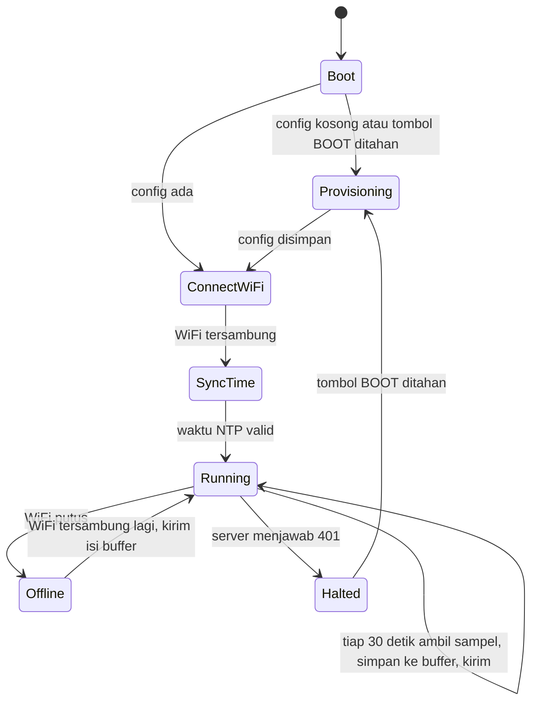

# Spesifikasi Firmware & Hardware

| Atribut | Isi |
| --- | --- |
| Status | Draft v0.1. Model modul masih asumsi, lihat bagian 1 |
| Target | ESP32 yang mengirim pH, TDS, dan suhu air ke `POST /api/ingest` |
| Kontrak | [API Contract bagian 7](03-api-contract.md#7-ingest-untuk-firmware) |

## 1. Yang masih harus dikonfirmasi

Dokumen ini ditulis sebelum model alat yang sudah dirakit diketahui. Kolom `model` di `src/data/seed.js` (Atlas EZO-pH, DS18B20 Waterproof, Gravity TDS V1.0) adalah data contoh UI, jadi belum bisa dijadikan acuan. Sebelum minggu 1, isi tabel ini:

| Komponen | Asumsi di dokumen ini | Model sebenarnya |
| --- | --- | --- |
| Board | ESP32 klasik (DevKit, 4 MB flash) | |
| Sensor pH | Modul pH analog (output tegangan) | |
| Sensor TDS | Modul TDS analog (output tegangan) | |
| Sensor suhu | DS18B20 waterproof (OneWire) | |
| Catu daya | Adaptor USB 5 V | |
| Jumlah unit | Belum diketahui berapa satuan dan berapa paket | |

Kalau ternyata modul pH memakai antarmuka I2C atau UART (misalnya keluarga Atlas EZO), bagian wiring dan pembacaan pH perlu ditulis ulang. Alur buffer, waktu, dan pengiriman tidak berubah.

## 2. Varian alat

| Varian | Tipe IoT | Isi |
| --- | --- | --- |
| Satuan pH | `AQ-PH` | ESP32 + probe pH |
| Satuan suhu | `AQ-TMP` | ESP32 + DS18B20 |
| Satuan TDS | `AQ-TDS` | ESP32 + probe TDS |
| Paket kualitas air | `AQ-WATER-01` | ESP32 + probe pH + probe TDS + DS18B20 |

Semua varian dibangun dari satu basis kode. Bedanya hanya di build flag PlatformIO.

## 3. Wiring (usulan untuk ESP32 klasik)

| Sinyal | Pin ESP32 | Catatan |
| --- | --- | --- |
| Output analog pH | GPIO34 (ADC1) | Pin input saja, cocok untuk analog |
| Output analog TDS | GPIO35 (ADC1) | Pin input saja |
| Data DS18B20 | GPIO4 | Pasang resistor pull-up 4,7 kΩ ke 3,3 V |
| Daya modul TDS | GPIO25 lewat transistor/MOSFET | Hanya untuk varian paket, lihat bagian 3.1 |
| LED status | GPIO2 | LED bawaan di banyak board DevKit |
| Tombol provisioning | GPIO0 (BOOT) | Ditahan 5 detik saat menyala untuk masuk mode setup |

Aturan wajib:

- Sensor analog hanya di pin ADC1 (GPIO32 sampai 39). ADC2 tidak bisa dibaca selama WiFi aktif.
- Tegangan output modul analog ke pin ESP32 tidak boleh lebih dari 3,3 V. Banyak modul pH analog bekerja di 5 V dan outputnya bisa melewati 3,3 V, jadi cek dengan multimeter dulu dan pakai pembagi tegangan kalau perlu.
- Pakai `analogReadMilliVolts()` dari core Arduino-ESP32, bukan `analogRead()` mentah, karena fungsi ini sudah memakai kalibrasi ADC bawaan chip.

### 3.1 Interferensi pH dan TDS di varian paket

Probe TDS mengalirkan sinyal eksitasi ke air, dan sinyal ini bisa mengganggu pembacaan probe pH yang tercelup di air yang sama. Usulannya: daya modul TDS diputus lewat GPIO25 saat pH dibaca, lalu dinyalakan lagi untuk membaca TDS. Ini perlu dibuktikan di uji bench (lihat [Test Plan](07-test-plan.md), HW-04) sebelum dianggap cukup.

## 4. Arsitektur firmware



Modul kode:

| Modul | Tugas |
| --- | --- |
| `config` | Baca dan tulis konfigurasi di NVS (`Preferences`) |
| `provisioning` | Portal WiFiManager untuk mengisi WiFi, URL API, `deviceId`, dan credential |
| `sensors/ph`, `sensors/tds`, `sensors/temp` | Baca satu sensor, kembalikan nilai terkalibrasi |
| `sampler` | Jadwal 30 detik, ambil median, susun record |
| `buffer` | Antrean record di LittleFS |
| `uplink` | Kirim ke `/api/ingest`, tangani response dan backoff |
| `clock` | Sinkron NTP, cek waktu valid |
| `status_led` | Pola kedip sesuai state |

Library yang diusulkan: `OneWire`, `DallasTemperature`, `WiFiManager`, `ArduinoJson`, serta `LittleFS`, `HTTPClient`, dan `WiFiClientSecure` dari core.

### 4.1 Build flag per varian

```ini
; platformio.ini
[env]
platform = espressif32
board = esp32dev
framework = arduino
board_build.filesystem = littlefs

[env:satuan_ph]
build_flags = -DJF_TYPE=\"AQ-PH\" -DJF_HAS_PH=1

[env:satuan_tmp]
build_flags = -DJF_TYPE=\"AQ-TMP\" -DJF_HAS_TEMP=1

[env:satuan_tds]
build_flags = -DJF_TYPE=\"AQ-TDS\" -DJF_HAS_TDS=1

[env:paket_water]
build_flags = -DJF_TYPE=\"AQ-WATER-01\" -DJF_HAS_PH=1 -DJF_HAS_TDS=1 -DJF_HAS_TEMP=1 -DJF_TDS_POWER_PIN=25
```

Lokasi kode firmware diusulkan di folder `firmware/` di repo ini, supaya kontrak ingest dan firmware berubah dalam PR yang sama.

## 5. Pengambilan sampel

- Interval 30 detik, sama dengan simulator sekarang.
- Setiap sensor analog dibaca 15 kali dengan jeda 20 ms, lalu diambil mediannya.
- Suhu dibaca lebih dulu, karena nilainya dipakai untuk kompensasi TDS.

### 5.1 pH

Kalibrasi 2 titik menghasilkan tegangan di buffer 7,00 (`V7`) dan 4,00 (`V4`). Nilai pH dihitung secara linear:

```
pH = 7.00 + (V - V7) * (4.00 - 7.00) / (V4 - V7)
```

### 5.2 TDS

Kalau modulnya Gravity TDS (DFRobot SEN0244), rumus dari contoh kode pabrikannya:

```
koef      = 1.0 + 0.02 * (suhu - 25.0)
Vkomp     = V / koef
tds_ppm   = (133.42 * Vkomp^3 - 255.86 * Vkomp^2 + 857.39 * Vkomp) * 0.5 * k
```

`k` adalah faktor kalibrasi 1 titik (bawaan 1,0). Untuk IoT satuan TDS yang tidak punya sensor suhu, `suhu` diisi 25 °C. Kalau modulnya berbeda, rumus mengikuti datasheet modul tersebut. Rentang ukur modul juga menentukan nilai `max_value` sensor `tds` di database.

### 5.3 Suhu

DS18B20 dibaca dengan resolusi 12 bit. Nilai `-127` atau `85` saat pertama menyala dianggap gagal baca dan tidak dikirim.

## 6. Waktu

- Waktu disinkronkan ke NTP saat boot dan setiap 6 jam.
- Sampel baru disimpan setelah waktu valid. Server menolak `measuredAt` yang lebih dari 60 detik di masa depan, dan menolak waktu sebelum credential dibuat.
- Selama WiFi putus, jam internal ESP32 tetap berjalan, jadi sampel tetap punya waktu.
- Batasan yang diketahui: kalau alat restart saat WiFi mati, jam hilang dan sampel tidak bisa disimpan sampai NTP tersambung lagi. Kalau ini jadi masalah di lapangan, solusinya modul RTC (misalnya DS3231).
- Format kirim: `2026-10-10T08:00:00.000Z`. Milidetik wajib ada, karena validasi ingest mewajibkannya.

## 7. Buffer offline

- Setiap sampel disimpan dulu ke buffer sebelum dikirim, jadi buffer juga berfungsi sebagai antrean kirim.
- Record disimpan dalam format biner ringkas di LittleFS: `messageId` (16 byte), `measuredAt` dalam milidetik (8 byte), slot 3 nilai `float` (12 byte), lalu RSSI saat pengukuran (1 byte, `-128` kalau Wi-Fi putus) dan 3 byte cadangan. Ukuran tetap 40 byte per record.
- Target kapasitas 48 jam: 5.760 record × 40 byte ≈ 230 KB data record. Ini muat di partisi LittleFS bawaan board 4 MB.
- JSON baru disusun saat record akan dikirim, tetapi semua isinya berasal dari record. RSSI tidak dibaca ulang saat kirim karena server membandingkan `meta` untuk idempotensi ([ADR-0012](adr/0012-idempotensi-ingest-mencakup-metadata.md)).
- `messageId` adalah UUID v4 yang dibuat dari `esp_random()` saat sampel diambil, bukan saat dikirim. Dengan begitu pengiriman ulang tidak membuat data ganda.
- Kalau buffer penuh, record paling lama dibuang dan kejadian ini dicatat di log serial.

## 8. Pengiriman

- `POST {API_URL}/api/ingest` dengan header `Authorization: Bearer <credential>` dan `Content-Type: application/json`.
- Record dikirim satu per satu dari yang paling lama. Ini menjaga urutan dan cocok dengan perilaku server yang tidak menimpa nilai terbaru dengan data lama.
- Backoff saat gagal sementara: 5 detik, lalu dikali 2 setiap gagal, maksimal 5 menit.
- Penanganan response mengikuti tabel di [API Contract bagian 7](03-api-contract.md#7-ingest-untuk-firmware).
- HTTPS: root CA server ditanam di firmware (misalnya ISRG Root X1 kalau sertifikat dari Let's Encrypt). Mode HTTP hanya boleh untuk alamat lokal saat development, mengikuti aturan yang sama dengan `simulator.ts`.

## 9. Provisioning

1. Admin membuat device di Kelola IoT dan mencatat `deviceId` serta `credential` yang hanya tampil sekali.
2. Alat dinyalakan dengan tombol BOOT ditahan 5 detik, lalu membuka hotspot `JagoFarm-Setup-<4 digit MAC>`.
3. Dari HP, isi SSID WiFi, password, URL API, `deviceId`, dan `credential` di portal.
4. Semua isian disimpan di NVS. Credential tidak pernah dicetak ke serial.
5. Kalau device dipindah ke pemilik lain, server merotasi credential. Alat akan mendapat 401 dan masuk state Halted sampai diprovisioning ulang.

## 10. Kalibrasi

| Sensor | Prosedur | Frekuensi |
| --- | --- | --- |
| pH | Bilas probe dengan air suling, celup ke buffer 7,00, tunggu stabil, simpan `V7`. Bilas, ulangi dengan buffer 4,00 untuk `V4` | Tiap 2 sampai 4 minggu (sesuai teks panduan di `seed.js`) |
| TDS | Celup ke larutan standar yang nilainya diketahui, hitung `k = nilai standar / nilai terbaca` | Saat pemasangan dan setiap kali probe dibersihkan |
| Suhu | Tidak perlu kalibrasi rutin. Cukup dibandingkan dengan termometer acuan saat pemasangan | Saat pemasangan |

Hasil kalibrasi disimpan di NVS alat. Tanggal kalibrasi dicatat admin di dashboard (`calibrated_at`).

## 11. Pola LED status

| Pola | Arti |
| --- | --- |
| Kedip cepat terus | Mode provisioning |
| Kedip lambat | Menyambung WiFi atau menunggu NTP |
| Menyala singkat tiap 30 detik | Sampel tersimpan dan terkirim |
| Kedip 2 kali tiap 30 detik | Sampel tersimpan, belum terkirim (offline) |
| Menyala terus | Halted (credential ditolak) |
