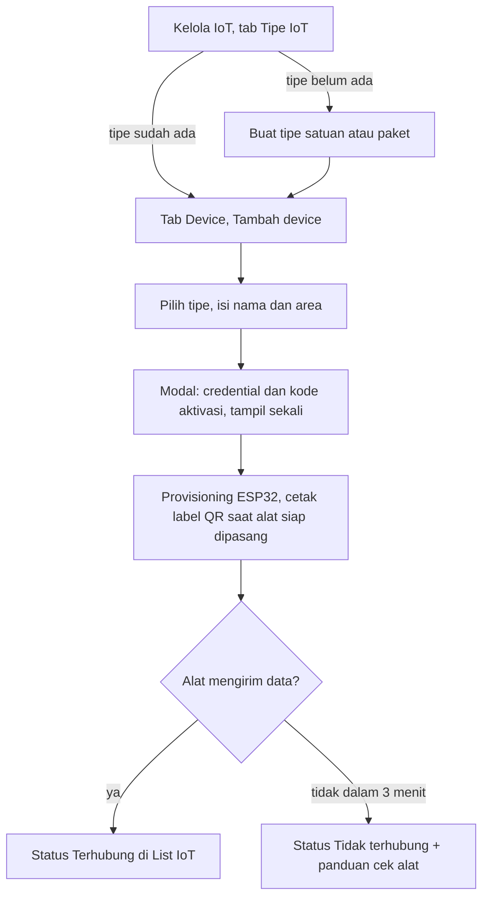
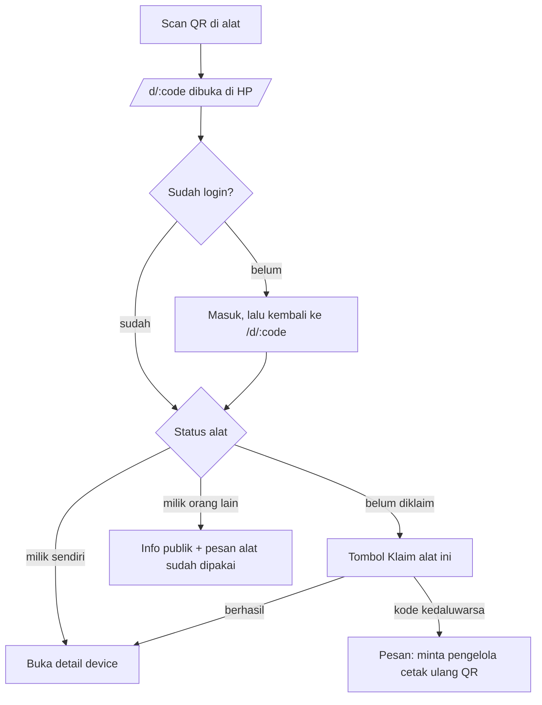
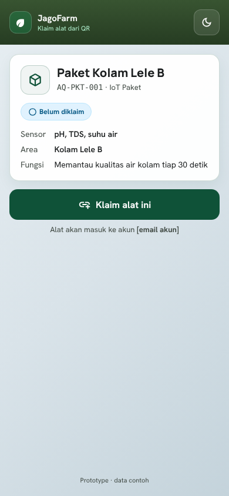
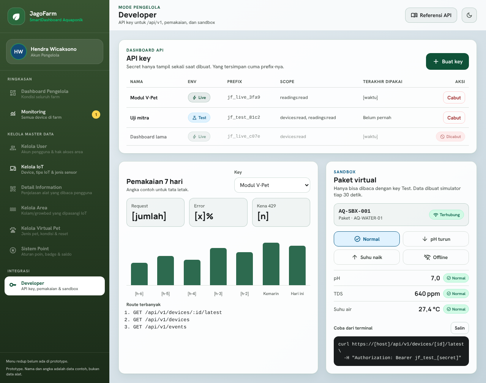

# UI/UX Design: IoT System

| Atribut | Isi |
| --- | --- |
| Status | Draft v0.1 |
| Arah desain | [`DESIGN.md`](../../DESIGN.md) (tema Lumina Aqua, dial ENERGY 1 / RHYTHM 2 / MOTION 1) |
| Komponen | [Design System](06-design-system.md) |
| Gambar desain | [design/README.md](design/README.md) |

## 1. Prinsip

Ketiga prinsip ini diambil dari `DESIGN.md` dan dipakai untuk memutuskan setiap layar IoT:

1. **Angka dulu.** Nilai sensor dan statusnya adalah fokus utama setiap layar monitoring. Elemen lain mengikuti.
2. **Status selalu tertulis.** Warna hanya memperkuat. Setiap status punya label teks dan ikon.
3. **Tenang.** Tidak ada animasi masuk dan tidak ada gerakan berulang. Update live hanya mengganti angka, tanpa efek kedip.

Tambahan khusus IoT:

4. **Jujur soal kesegaran data.** Setiap nilai menampilkan kapan diukur. Data yang sudah lewat 90 detik ditandai "Data tertunda", bukan ditampilkan seolah-olah baru.
5. **Lapangan dulu untuk scan QR.** Halaman klaim dibuka dari HP di pinggir kolam, jadi dirancang untuk layar sempit dan satu tangan.

## 2. Peran dan tujuan

| Peran | Tujuan utama di IoT | Perangkat yang dipakai |
| --- | --- | --- |
| Pengguna lapangan | Tahu kondisi air sekarang, tahu kapan harus bertindak, klaim alat baru | HP saat di kolam, laptop saat rekap |
| Pengelola | Daftarkan alat, cetak QR, atur ambang, pantau seluruh farm | Laptop (Windows skala 150%, lebar efektif 841 px) |
| Developer / mitra | Buat key, coba API, pantau pemakaian | Laptop |

## 3. Arsitektur informasi

Menu baru diberi tanda (baru) dan menu yang berubah diberi tanda (diubah).

```
Pengguna
├── Dashboard
├── List IoT (diubah)              sumber data dari API, filter tipe satuan/paket
│   └── Detail device (diubah)     /iot/:id
├── Monitoring (baru)              /monitoring, tab Per paket · Per sensor · Per area
├── Detail Information (diubah)    scan QR, sekarang juga bisa klaim dan input kode manual
└── Kelola Area, V-Pet, Gamifikasi, Chatbot (tetap)

Pengelola
├── Dashboard Pengelola
├── Monitoring (baru)              sama dengan pengguna, melihat semua device
├── Kelola IoT (diubah)            /admin/iot, tab Device · Tipe IoT · Jenis Sensor
├── Kategori Device                dihapus, isinya pindah ke tab Jenis Sensor
├── Developer (baru)               /developer, API key, pemakaian, sandbox
└── menu lain tetap

Publik
├── /d/:code (baru)                halaman tujuan QR, mobile-first
└── /docs (baru)                   referensi API, dilayani backend
```

Gambarnya ada di [design/README.md](design/README.md).

Menu Developer untuk sementara hanya muncul di akun pengelola. Kalau keputusan Q2 dan Q3 di PRD mengizinkan user biasa membuat key, menu ini ditambahkan ke grup Pengguna.

## 4. Alur utama

### 4.1 Pengelola mendaftarkan alat sampai terpasang



Kode aktivasi di label berlaku 24 jam ([ADR-0009](adr/0009-qr-dicetak-saat-pemasangan.md)). Kalau pemasangan tertunda, pengelola menekan "Buat ulang kode aktivasi" di baris device lalu mencetak label baru.

### 4.2 Pengguna mengklaim alat lewat QR



Kalau browser tidak mendukung `BarcodeDetector` (Safari dan Firefox saat dokumen ini ditulis), `QrScanner.jsx` menampilkan pesan dan form kode manual. Halaman Detail Information juga menyediakan input kode alat. Pemindai kamera bawaan ponsel tetap bisa membuka URL `/d/:code` yang tersimpan di QR.

### 4.3 Pengguna menanggapi nilai di luar ambang

1. Kartu sensor berubah ke status "Di bawah ambang" atau "Di atas ambang", lengkap dengan ikon dan teks.
2. Badge berisi jumlah kejadian muncul di menu Monitoring pada sidebar, dengan label untuk pembaca layar "[n] kejadian perlu perhatian".
3. Pengguna membuka grafik sensor dan melihat garis ambang serta titik saat nilai mulai keluar.
4. Log kejadian mencatat kapan nilai keluar ambang dan kapan kembali normal.

### 4.4 Developer membuat key dan mencoba sandbox

1. Buka Developer, klik Buat key, pilih environment Test dan scope.
2. Modal menampilkan secret satu kali, dengan tombol salin dan peringatan bahwa secret tidak bisa dilihat lagi.
3. Panel Sandbox di halaman yang sama menampilkan device virtual beserta pilihan skenario (Normal, pH turun, Suhu naik, Offline).
4. Tombol "Referensi API" di top bar membuka Scalar (`/docs`) di tab baru.

## 5. Spesifikasi layar

Setiap layar yang menampilkan data wajib punya empat state: loading, kosong, error, dan berisi. Pesan error memakai teks dari backend (`error.message`), tidak boleh diganti data contoh.

### 5.1 List IoT (`/iot`), diubah

| Bagian | Isi |
| --- | --- |
| Ringkasan | 4 StatCard: Total device, Terhubung, Data tertunda, Tidak terhubung |
| Filter | Cari, Tipe (Semua, Satuan, Paket), Area, Status |
| Daftar | Kartu device: nama, kode, badge tipe, badge status, nilai terakhir tiap sensor beserta state ambang, waktu pengukuran relatif |
| Loading | Teks "Memuat perangkat..." dengan `role="status"` |
| Kosong (belum punya device) | "Belum ada perangkat di akun ini." + tombol "Scan QR alat" |
| Kosong (hasil filter) | "Tidak ada device cocok" (teks yang sudah ada) |
| Error | Pesan dari backend + tombol "Coba lagi" |

Kartu IoT paket menampilkan semua sensornya dalam satu kartu. IoT satuan menampilkan satu nilai yang lebih besar.

Gambar: [berisi](design/screens/01-list-iot.png), [gelap](design/screens/01b-list-iot-gelap.png), [kosong](design/screens/01c-list-iot-kosong.png), [error](design/screens/01d-list-iot-error.png), [loading](design/screens/01e-list-iot-loading.png), [HP](design/screens/01f-list-iot-hp.png).

### 5.2 Detail device (`/iot/:id`), diubah

| Bagian | Isi |
| --- | --- |
| Kepala | Nama, kode, badge tipe, badge status, tombol Lepas alat (pemilik). Tombol QR hanya untuk pengelola, jadi tidak tampil di gambar yang memakai sudut pandang pengguna |
| Nilai sekarang | Satu SensorValue per sensor, dengan waktu ukur dan sumber ambang (area atau default) |
| Grafik | Pilihan sensor (untuk paket) dan rentang 1 jam, 24 jam, 7 hari. Garis rata-rata dengan pita min-max dan garis ambang |
| Kejadian | 5 kejadian terakhir + tautan "Lihat semua" ke Monitoring |
| Kesehatan unit | Firmware, RSSI, kalibrasi terakhir, kiriman terakhir |
| Fungsi alat | Daftar fungsi alat, teks yang sama dengan yang tampil saat QR dipindai |

Teks "Diperbarui otomatis setiap 5 detik (simulasi)" diganti menjadi "Live" saat SSE tersambung, atau "Diperbarui tiap 30 detik" saat memakai polling.

Gambar: [terang](design/screens/02-detail-device.png), [gelap](design/screens/02b-detail-device-gelap.png).

### 5.3 Monitoring (`/monitoring`), baru

Tab **Per paket**: grid kartu IoT paket. Setiap kartu menampilkan nilai semua sensornya dan sparkline 24 jam per sensor.

Tab **Per sensor**: pilih jenis sensor (pH, TDS, Suhu air). Tabel berisi semua device yang punya sensor itu, baik satuan maupun paket. Kolomnya: device (beserta tipe dan kode), area, nilai, ambang, dan waktu ukur. Device yang keluar ambang diurutkan paling atas. Di atas tabel ada grafik perbandingan 24 jam untuk maksimal 3 device, supaya warna garis tetap dari palet (`primary`, `tertiary`, `secondary`).

Tab **Per area**: area beserta device di dalamnya. Ringkasan per sensor (min, rata-rata, maks hari ini) dihitung dari semua device di area itu. Ini menggantikan perhitungan statistik harian yang sekarang ada di `SmartStore`.

Panel **Log kejadian** ada di samping (desktop) atau di bawah (layar sempit), bisa difilter Semua, Ambang, atau Koneksi.

Gambar: [per paket](design/screens/03-monitoring-per-paket.png), [per sensor](design/screens/03b-monitoring-per-sensor.png), [per area](design/screens/03c-monitoring-per-area.png), [gelap](design/screens/03d-monitoring-gelap.png).

### 5.4 Kelola IoT (`/admin/iot`), diubah jadi 3 tab

Tab **Device**: tabel yang sudah ada, ditambah kolom tipe dan kolom kiriman terakhir. Aksi per baris: Label QR, Ubah, Buat ulang kode aktivasi, Catat kalibrasi, dan Nonaktifkan. Hapus device diganti dengan Nonaktifkan, karena readings terikat ke device.

Tab **Tipe IoT**: tabel tipe (kode, nama, jenis, sensor, jumlah device, status) dengan aksi Nonaktifkan atau Aktifkan. Tipe nonaktif tidak bisa dipakai untuk device baru. Form tambah tipe:

- Pilihan jenis: Satuan atau Paket (radio).
- Satuan menampilkan satu select sensor. Paket menampilkan daftar checkbox sensor dengan isian label per sensor.
- Validasi langsung: "Paket butuh minimal 2 sensor."
- Kode tipe dikunci kalau tipe sudah punya device.

Tab **Jenis Sensor**: menggantikan menu Kategori Device. Form berisi kode, nama, satuan, rentang valid, desimal, dan ambang default.

Gambar: [device](design/screens/04-kelola-iot-device.png), [tipe](design/screens/04b-kelola-iot-tipe.png), [jenis sensor](design/screens/04c-kelola-iot-jenis-sensor.png), [tambah device](design/screens/04d-kelola-iot-tambah-device.png), [device dibuat](design/screens/04e-kelola-iot-device-dibuat.png), [label QR](design/screens/04f-kelola-iot-label-qr.png), [tambah tipe paket](design/screens/05-tambah-tipe-paket.png), [tambah tipe satuan](design/screens/05b-tambah-tipe-satuan.png).

### 5.5 Halaman tujuan QR (`/d/:code`), baru, mobile-first



Tombol Klaim setinggi 52 px dan selebar layar, supaya mudah ditekan dengan satu tangan di pinggir kolam.

State yang wajib ada: belum login, belum diklaim, milik sendiri, milik orang lain, kode kedaluwarsa, kode tidak dikenal, dan backend tidak tersedia. Gambar semua state ada di [design/README.md](design/README.md), termasuk [mode gelap](design/screens/07i-klaim-qr-gelap.png).

Pratinjau publik hanya menampilkan nama, kode, tipe, sensor, status klaim, dan validitas kode aktivasi. Area/kolam, readings, identitas akun, credential, dan kode aktivasi tidak ditampilkan. Informasi area menunggu keputusan Q4.

### 5.6 Developer (`/developer`), baru



Isinya tabel API key (nama, env, prefix, scope, terakhir dipakai, aksi Cabut), panel pemakaian 7 hari per key (dengan state kosong untuk key yang belum pernah dipakai), dan panel Sandbox berisi device virtual, pilihan skenario, serta contoh `curl`.

Modal secret key:

- Judul: "Simpan key ini sekarang".
- Isi: secret dalam blok kode dengan tombol Salin, dan kalimat "Key ini tidak akan ditampilkan lagi. Kalau hilang, cabut lalu buat key baru."
- Tombol Tutup baru aktif setelah tombol Salin ditekan, atau setelah kotak "Sudah saya simpan" dicentang.

Konfirmasi cabut key: "Cabut key [nama key]? Semua request dengan key ini langsung ditolak." Tombolnya "Cabut key" (danger) dan "Batal".

Gambar: [secret key](design/screens/06c-secret-key.png), [secret key gelap](design/screens/06d-secret-key-gelap.png), [Developer gelap](design/screens/06b-developer-gelap.png).

## 6. Status dan teks

### 6.1 Status koneksi

| Backend | Label | Ikon (Material Symbols) | Tone Badge |
| --- | --- | --- | --- |
| `online` | Terhubung | `wifi` | `ok` |
| `stale` | Data tertunda | `schedule` | `warn` |
| `offline` | Tidak terhubung | `wifi_off` | `bad` |
| Kalibrasi lewat jatuh tempo | Perlu kalibrasi | `build` | `info` |
| Device baru, belum diklaim | Menunggu klaim | `hourglass_top` | `info` |

### 6.2 State ambang

| `state` | Label | Ikon | Tone |
| --- | --- | --- | --- |
| `normal` | Normal | `check_circle` | `ok` |
| `low` | Di bawah ambang | `arrow_downward` | `warn` |
| `high` | Di atas ambang | `arrow_upward` | `warn` |
| `unknown` | Tanpa ambang | `remove` | `muted` |

### 6.3 Teks penting

| Situasi | Teks |
| --- | --- |
| Backend mati | "Backend tidak tersedia. Data contoh tidak digunakan sebagai pengganti." (teks `pilotApi.js` yang sudah ada) |
| Device baru belum kirim data | "Belum ada data. Pastikan alat sudah diprovisioning dan tersambung WiFi." |
| Klaim berhasil | "AQ-PKT-001 sudah masuk ke akun Anda." |
| Kode aktivasi kedaluwarsa | "Kode di QR ini sudah kedaluwarsa. Minta pengelola mencetak ulang QR." |
| Alat milik orang lain | "Alat ini sudah dipakai akun lain. Hubungi pengelola kalau ini keliru." |

## 7. Aksesibilitas dan responsif

- Kontras teks minimal WCAG AA di mode terang dan gelap. Warna status memakai tone Badge yang sudah ada, karena tone itu sudah punya varian gelap.
- Semua aksi bisa dijalankan dengan keyboard. Saat modal dibuka, fokus pindah ke elemen pertama di dalamnya, Tab dan Shift+Tab berputar di dalam dialog, Escape menutup, dan fokus kembali ke tombol pemicu. Pola ini dipasang sekali di komponen `Modal` (`ui.jsx`).
- Tombol yang berulang di tabel punya nama aksesibel yang menyebut barisnya, misalnya "Nonaktifkan AQ-TMP" atau "Buat ulang kode aktivasi AQ-PH-002". Label `select` dipasang dengan `for`/`id`, bukan membungkus `select`, supaya namanya tidak tercampur teks opsi.
- Nilai yang berubah lewat SSE diumumkan lewat region `aria-live="polite"`, hanya ketika state ambang berubah, bukan setiap angka berubah.
- Target sentuh minimal 44 px untuk halaman `/d/:code` dan tombol utama di layar sempit.
- Grafik punya ringkasan teks di bawahnya (nilai terakhir, min, maks) supaya informasinya tetap terbaca tanpa melihat grafik.
- Tidak ada scroll horizontal di lebar 360 px. Ini sudah diuji di prototype untuk List IoT, Detail device, Monitoring, Kelola IoT, Developer, dan halaman QR. Tabel lebar memakai kotak scroll horizontal sendiri, jadi halaman tidak ikut bergeser.
- Di lebar 720 px ke bawah, sidebar disembunyikan dan diganti tombol Menu (44 px) di top bar. Ini usulan perubahan untuk `SmartSidebar`, karena sidebar 208 px yang selalu tampil menyisakan sekitar 180 px untuk konten di HP.
