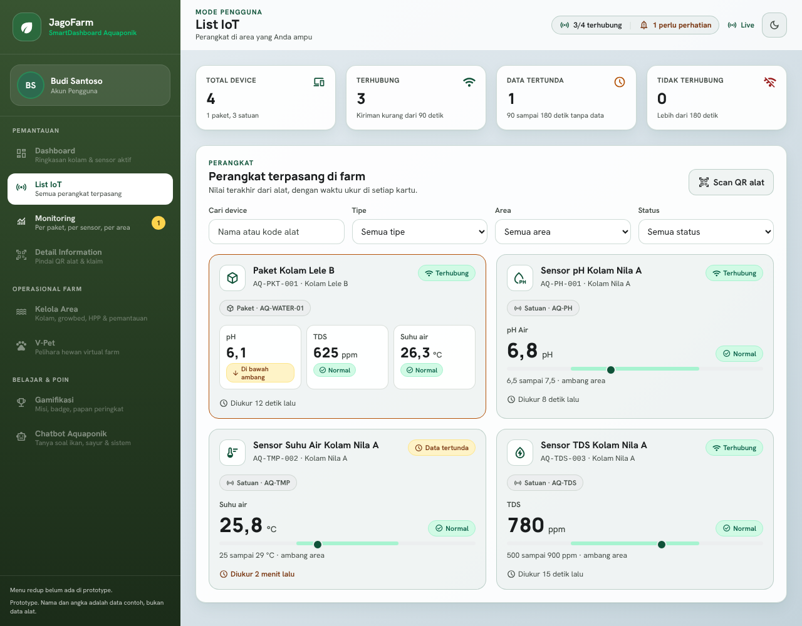
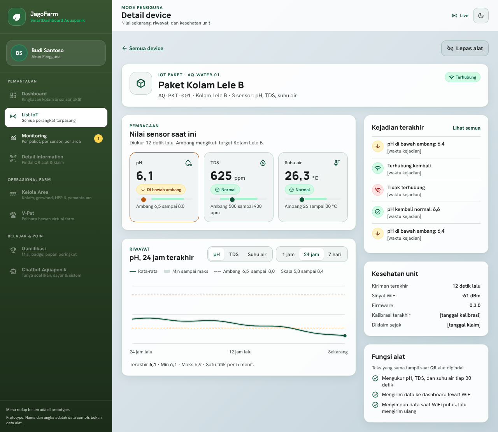
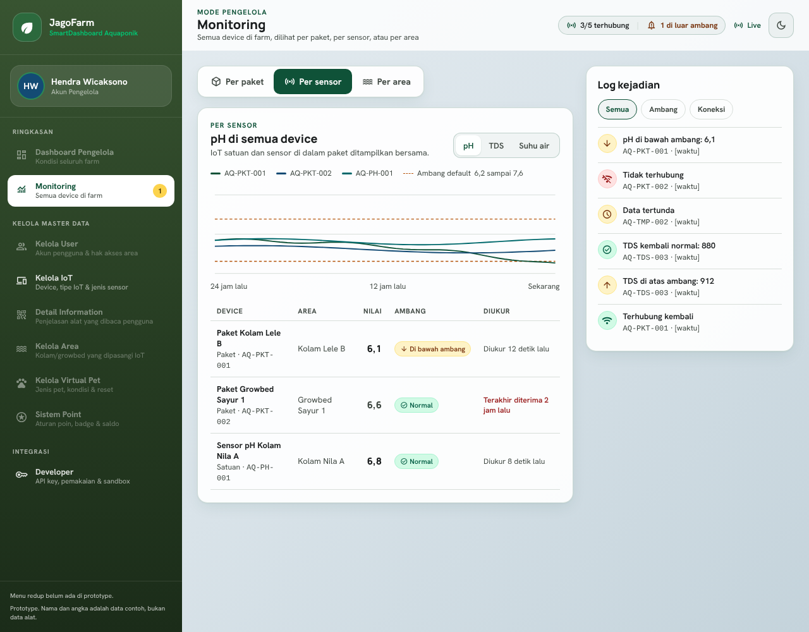
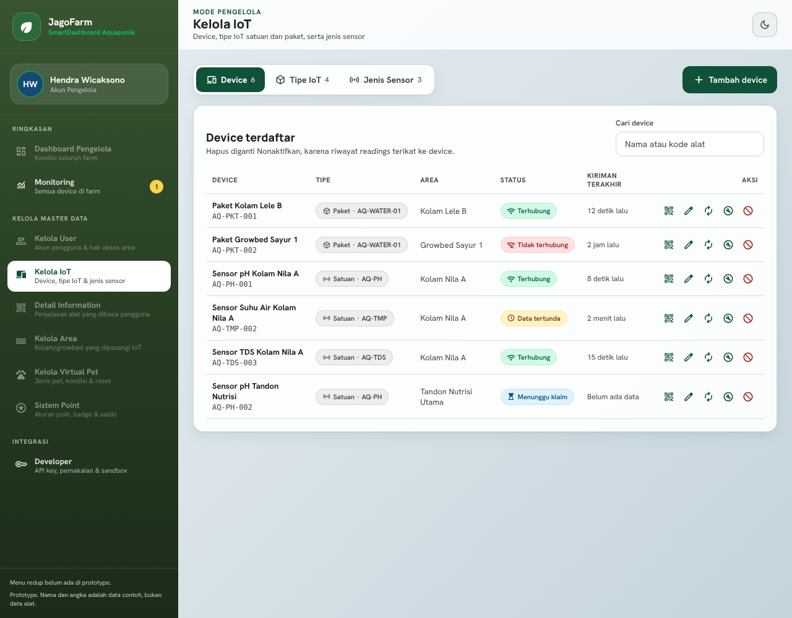
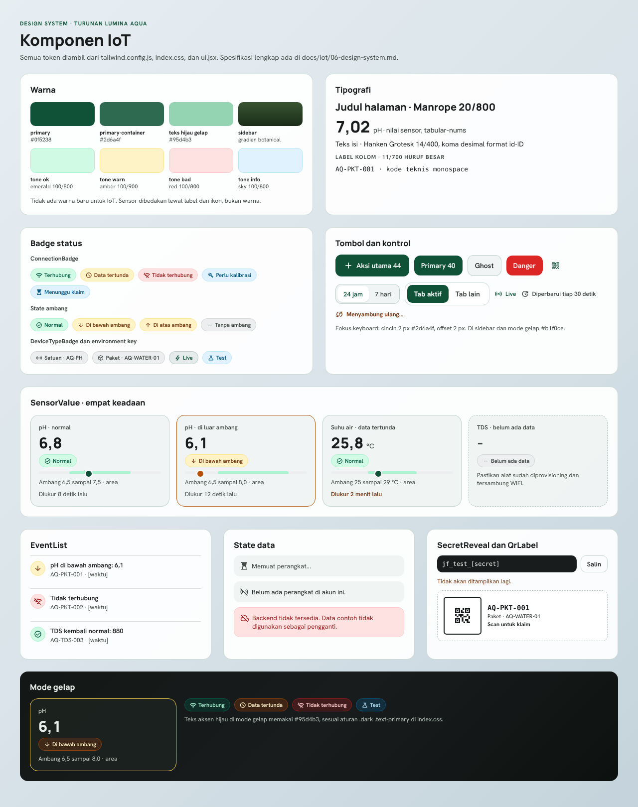

# Desain Halaman IoT (prototype)

Gambar di folder `screens/` adalah acuan visual untuk implementasi halaman IoT. Semua halaman memakai token dan komponen yang sudah ada (`tailwind.config.js`, `src/index.css`, `src/components/ui.jsx`), jadi implementasinya cukup menyusun ulang komponen, bukan membuat gaya baru. Aturan lengkapnya ada di [Design System](../06-design-system.md), sedangkan alur dan teksnya ada di [UI/UX Design](../05-ux-design.md).

- Prototype interaktif (canvas Claude, bisa diklik): [Prototype IoT System JagoFarm](https://claude.ai/artifact/P9EBSfnG9GUpbnP3jSR1S1). Link ini privat sampai dibagikan dari menu Share.
- Source prototype ada di `prototype/*.dc.html`. Isinya HTML dengan style inline, jadi nilai jarak, ukuran, dan warna bisa dicontek langsung saat menulis JSX.
- Semua nama, kode alat, dan angka di gambar adalah data contoh. Teks dalam kurung siku, misalnya `[waktu]` dan `[jumlah]`, adalah placeholder yang diisi dari API.

## Peta layar

| Layar | Route | Gambar | Data dari API |
| --- | --- | --- | --- |
| List IoT | `/iot` | [01](screens/01-list-iot.png), [gelap](screens/01b-list-iot-gelap.png), [kosong](screens/01c-list-iot-kosong.png), [error](screens/01d-list-iot-error.png), [loading](screens/01e-list-iot-loading.png), [HP](screens/01f-list-iot-hp.png) | `GET /devices`, `GET /devices/:id/latest` |
| Detail device | `/iot/:id` | [02](screens/02-detail-device.png), [gelap](screens/02b-detail-device-gelap.png) | `GET /devices/:id`, `/latest`, `/readings`, `GET /events?deviceId=` |
| Monitoring | `/monitoring` | [per paket](screens/03-monitoring-per-paket.png), [per sensor](screens/03b-monitoring-per-sensor.png), [per area](screens/03c-monitoring-per-area.png), [gelap](screens/03d-monitoring-gelap.png) | `GET /devices`, `/sensors/:code/overview`, `/readings`, `/events`, `/stream` |
| Kelola IoT | `/admin/iot` | [device](screens/04-kelola-iot-device.png), [tipe](screens/04b-kelola-iot-tipe.png), [jenis sensor](screens/04c-kelola-iot-jenis-sensor.png), [tambah device](screens/04d-kelola-iot-tambah-device.png), [device dibuat](screens/04e-kelola-iot-device-dibuat.png), [label QR](screens/04f-kelola-iot-label-qr.png) | `/devices`, `/device-types`, `/sensor-types`, `POST /devices/:id/qr` |
| Tambah tipe IoT (modal) | `/admin/iot` tab Tipe | [paket](screens/05-tambah-tipe-paket.png), [satuan](screens/05b-tambah-tipe-satuan.png), [gelap](screens/05c-tambah-tipe-gelap.png) | `POST /device-types` |
| Developer | `/developer` | [06](screens/06-developer.png), [gelap](screens/06b-developer-gelap.png), [secret key](screens/06c-secret-key.png), [secret key gelap](screens/06d-secret-key-gelap.png) | `/keys`, `/keys/:id/usage`, `PUT /sandbox/devices/:id/scenario` |
| Halaman QR (HP) | `/d/:code` | [belum diklaim](screens/07-klaim-qr-belum-diklaim.png), [belum login](screens/07b-klaim-qr-belum-login.png), [berhasil](screens/07c-klaim-qr-berhasil.png), [milik sendiri](screens/07d-klaim-qr-milik-sendiri.png), [milik orang lain](screens/07e-klaim-qr-milik-orang-lain.png), [kedaluwarsa](screens/07f-klaim-qr-kedaluwarsa.png), [kode tidak dikenal](screens/07g-klaim-qr-kode-tidak-dikenal.png), [backend mati](screens/07h-klaim-qr-backend-mati.png), [gelap](screens/07i-klaim-qr-gelap.png) | `GET /devices?code=`, `POST /devices/claim` |
| Komponen | Tidak ada route | [08](screens/08-komponen.png) | Acuan untuk `src/components/iot/` |

## Pratinjau

## Catatan implementasi

- Shell (sidebar dan top bar) tetap memakai `SmartSidebar` dan `SmartTopBar` yang sudah ada. Di gambar, menu Kategori Device sudah dihapus dan menu Monitoring serta Developer sudah ditambahkan.
- Di lebar 720 px ke bawah, sidebar disembunyikan dan diganti tombol Menu di top bar (lihat [gambar HP](screens/01f-list-iot-hp.png)). Ini usulan baru, karena `SmartApp.jsx` sekarang selalu menampilkan sidebar selebar 208 px, sehingga di HP konten hanya tersisa sekitar 180 px. Kalau disetujui, terapkan di `SmartSidebar` supaya semua halaman ikut.
- Menu aktif di sidebar mode gelap memakai latar `rgba(149,212,179,0.15)` dan teks `#b1f0ce`, sama dengan `dark:bg-inverse-primary/15` di kode.
- Modal (Tambah device, Label QR, Buat key) memindahkan fokus ke elemen pertama saat dibuka, mengunci Tab dan Shift+Tab di dalam dialog, menutup dengan Escape, lalu mengembalikan fokus ke tombol pemicu. Pola ini wajib dipindahkan ke komponen `Modal` di `ui.jsx`.
- Menu sidebar yang redup di prototype hanya penanda bahwa halamannya belum digambar. Di aplikasi, semua menu tetap aktif seperti biasa.
- Grafik di gambar digambar dengan SVG biasa. Implementasinya memakai `react-chartjs-2` dengan aturan di Design System bagian 4.4: animasi dimatikan, garis ambang putus-putus, dan pita min sampai maks.
- Kotak QR di gambar adalah placeholder. Implementasinya memakai `QrCode.jsx` yang sudah ada.
- Tombol yang di prototype hanya memunculkan pesan "Prototype: ..." (ubah, kalibrasi, nonaktifkan, unduh QR, buka /docs) harus disambungkan ke endpoint di [API Contract](../03-api-contract.md).
- Setiap halaman wajib punya empat state (loading, kosong, error, berisi). Contohnya bisa dilihat di gambar List IoT dan Halaman QR.

## Memperbarui gambar

Kalau desain di canvas diubah, ambil ulang screenshot dengan lebar 1280 px untuk desktop dan 390 px untuk HP, lalu timpa file dengan nama yang sama di `screens/`. Dengan begitu link di dokumen lain tidak perlu diganti.
